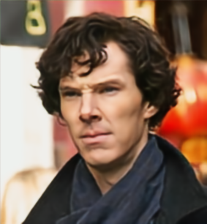
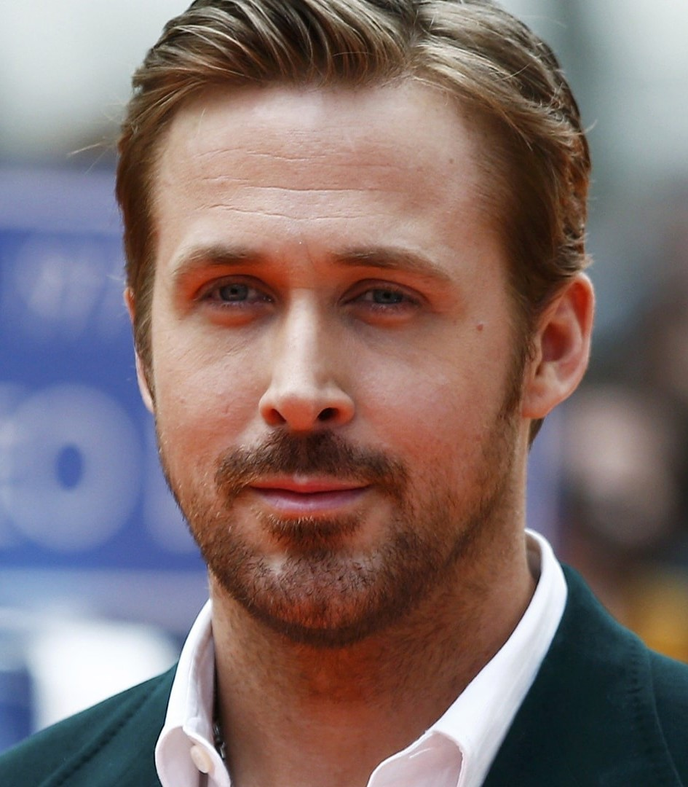

# UNet based face image enhancer

[](https://github.com/Ehsan-004/MNISTNoiseRemover)
[](https://github.com/Ehsan-004/TinyUrler/blob/main/LICENSE)
[](https://github.com/Ehsan-004)
</br>

## A convolutional neural network based on auto encoder and UNet architecture to increase face image enhancing.
</br>

main image | noisy image | model's output
|:-------------------------:|:-------------------------:|:-------------------------:|
 |  | 
 |  | 
 |  | 

<br>

## 📝 Description

The model receives noisy blured image and tries to decrease the blur and noise and recreate the main image. <br>
Model's architecture is based on UNet, actually the model is a tiny UNet!<br>
The dataset that the model is trained on, is celebA-HQ which is consist of 30000 images of celebrities' faces.<br>
* UNet is an auto encoder that keeps result of each downsample step and when it upsamples the feature maps, it concatenates the feature map of the same level while downsampling. Then it uses a convolution layer to devide number of channels by 2 and continiouses to upsample.<br>

</br>

<!--  -->

<div align="center">
    
</div>


</br>

## UI
There is also a UI to use this model created by chat GPT. <br>
You should first chosse the weights of the model (.pth file) and then you can test the model on your images and save the output.

<div align="center">
    
</div>

<br>

## Model architecture
```
FaceUNet(
  (down1): Sequential(
    (0): Conv2d(3, 64, kernel_size=(3, 3), stride=(1, 1), padding=(1, 1))
    (1): ReLU()
    (2): MaxPool2d(kernel_size=2, stride=2, padding=0, dilation=1, ceil_mode=False)
  )
  (up1): Sequential(
    (0): ConvTranspose2d(64, 3, kernel_size=(4, 4), stride=(2, 2), padding=(1, 1))
    (1): ReLU()
  )
  (conv1): Conv2d(6, 3, kernel_size=(3, 3), stride=(1, 1), padding=(1, 1))
  (down2): Sequential(
    (0): Conv2d(64, 128, kernel_size=(3, 3), stride=(1, 1), padding=(1, 1))
    (1): ReLU()
    (2): MaxPool2d(kernel_size=2, stride=2, padding=0, dilation=1, ceil_mode=False)
  )
  (up2): Sequential(
    (0): ConvTranspose2d(128, 64, kernel_size=(4, 4), stride=(2, 2), padding=(1, 1))
    (1): ReLU()
  )
  (conv2): Conv2d(128, 64, kernel_size=(3, 3), stride=(1, 1), padding=(1, 1))
  (down3): Sequential(
    (0): Conv2d(128, 256, kernel_size=(3, 3), stride=(1, 1), padding=(1, 1))
    (1): ReLU()
    (2): MaxPool2d(kernel_size=2, stride=2, padding=0, dilation=1, ceil_mode=False)
  )
  (up3): Sequential(
    (0): ConvTranspose2d(256, 128, kernel_size=(4, 4), stride=(2, 2), padding=(1, 1))
    (1): ReLU()
  )
  (conv3): Conv2d(256, 128, kernel_size=(3, 3), stride=(1, 1), padding=(1, 1))
  (sigmoid): Sigmoid()
)

```


## Note
The keypoint is in forward method when the skip connection in UNet performs: <br>
```
def forward(self, x):
    identity0 = x  # c = 3
    
    # ==--==--==--==-
    x = self.down1(x)  # c = 64
    identity1 = x  # c = 64
    
    # ==--==--==--==-
    x = self.down2(x)  # c = 128
    identity2 = x  # c = 128
    
    # ==--==--==--==-
    x = self.down3(x)  # c = 256
    
    # ==--==--==--==-
    x = self.up3(x)  # c = 128
    x = torch.cat([x, identity2], dim=1)  # c = 256
    x = self.conv3(x)  # c = 128  |  recover the channels again
    
    # ==--==--==--==-
    x = self.up2(x)  # c = 64
    x = torch.cat([x, identity1], dim=1)  # c = 128
    x = self.conv2(x)  # c = 64  |  recover the channels again
    
    # ==--==--==--==-
    x = self.up1(x)
    x = torch.cat([x, identity0], dim=1)  # c = 6
    x = self.sigmoid(self.conv1(x))  # c = 3  |  recover the channels again
```


## 🧑‍💻 Developer

- [Ehsan-004](https://github.com/Ehsan-004)

## 📜 License

This project is open-source and does not have a specific license. Feel free to use, modify, and distribute it as you see fit.
